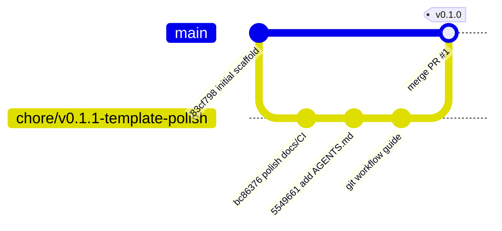

# Git Workflow

This project uses a simple branch-and-PR workflow.

## Current Shape

- `main` holds the latest stable template state.
- Feature or polish work happens on a named branch.
- A pull request compares the branch back into `main`.
- GitHub Actions runs CI on the pull request.
- After review and passing CI, the branch is merged into `main`.

For the v0.1.1 polish work:

```text
main
  83cf798 Initial FastMCP builder template

chore/v0.1.1-template-polish
  bc86376 Polish template public readiness
  5549661 Add agent instructions
  <current docs commits>
```

That means `main` does not yet contain the polish changes. The polish changes live on the branch and in PR #1 until the PR is merged.

## Diagram



Read the diagram as:

1. `main` starts with the initial scaffold commit.
2. A branch is created from `main`.
3. The branch receives focused polish commits.
4. PR #1 proposes merging those commits back into `main`.
5. After merge, `main` contains the full polished template.

## Commands Used

Create the branch:

```bash
git checkout -b chore/v0.1.1-template-polish
```

Commit scoped work:

```bash
git add .github/workflows/ci.yml CHANGELOG.md CONTRIBUTING.md LICENSE README.md
git commit -m "Polish template public readiness"
```

Push the branch:

```bash
git push -u origin chore/v0.1.1-template-polish
```

Open the pull request:

```bash
gh pr create --draft --base main --head chore/v0.1.1-template-polish
```

Check local sync state:

```bash
git status -sb
git rev-list --left-right --count HEAD...@{upstream}
```

If the ahead/behind output is:

```text
0 0
```

then the local branch and its remote tracking branch are in sync.

## After Merge

Once PR #1 is merged:

```bash
git checkout main
git pull --ff-only
git tag v0.1.0
git push origin v0.1.0
```

Only tag after `main` contains the license, CI workflow, changelog, contribution guide, README polish, and `AGENTS.md`.
